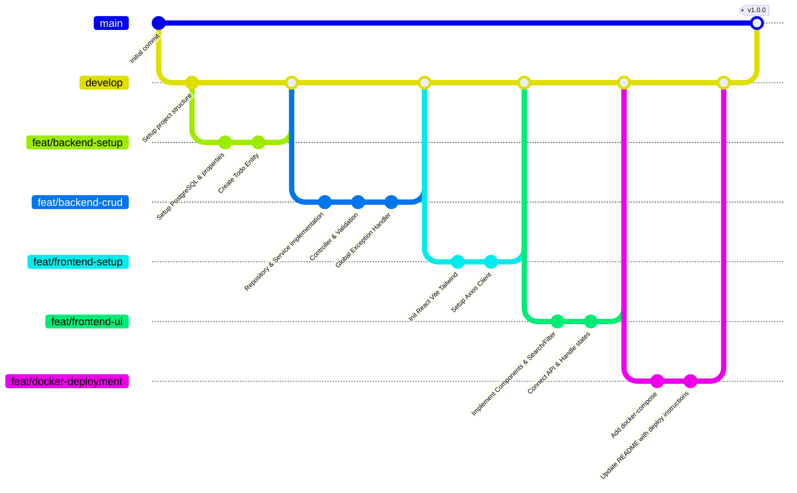

# Kế Hoạch Triển Khai & Phân Chia Nhánh Git - Todo App

Chào bạn! Dưới đây là kế hoạch chi tiết cho việc phát triển ứng dụng **Todo App** sử dụng cấu trúc dự án bạn đề xuất, với cơ sở dữ liệu **PostgreSQL**, Backend **Spring Boot 3**, Frontend **React (Vite + Tailwind CSS)** và quy trình phân nhánh Git tối ưu cho bài test tuyển dụng.

---

## 1. Mô Hình Phân Nhánh Git (Git Branching Strategy)

Để thể hiện phong cách làm việc chuyên nghiệp, chúng ta sẽ áp dụng mô hình **Git Flow rút gọn**, cam kết rõ ràng qua từng branch và Pull Request. Tránh commit trực tiếp lên branch chính.

### Các nhánh chính (Long-lived Branches):
*   `main` / `master`: Nhánh production. Chỉ chứa mã nguồn ổn định nhất, sẵn sàng deploy lên Render/Vercel.
*   `develop`: Nhánh tích hợp chính của các tính năng mới trước khi release.

### Các nhánh tính năng (Feature Branches):
Mỗi tính năng hoặc phần việc cụ thể sẽ được thực hiện trên một nhánh riêng xuất phát từ `develop` và merge ngược lại qua Pull Request sau khi hoàn thành.

---

## 2. Kế Hoạch Triển Khai Chi Tiết Qua Từng Nhánh

### Nhánh 1: `feat/backend-setup` (Khởi tạo Backend & Cấu hình DB)
*   **Mục tiêu**: Cài đặt kết nối PostgreSQL và định nghĩa thực thể Todo.
*   **Các bước thực hiện**:
    1.  Cập nhật file `application.properties` (hoặc `application.yml`) để cấu hình kết nối tới database PostgreSQL (Local hoặc Neon Console).
    2.  Tạo entity [Todo](file:///d:/MoiTruong_Visual/todo-app/backend/src/main/java/entity/Todo.java) với các trường dữ liệu và annotation Validation như mô tả (`@NotBlank`, `@Size`, `@CreationTimestamp`, `@UpdateTimestamp`).
*   **Commit mẫu**:
    *   `feat(backend): setup postgresql connection and database properties`
    *   `feat(backend): create Todo entity with validation rules`

### Nhánh 2: `feat/backend-crud` (Hoàn thiện RESTful API)
*   **Mục tiêu**: Viết đầy đủ logic CRUD, tìm kiếm, lọc trạng thái và xử lý ngoại lệ.
*   **Các bước thực hiện**:
    1.  Tạo `TodoRepository` kế thừa `JpaRepository` chứa các hàm tìm kiếm theo keyword và lọc theo completed.
    2.  Tạo `TodoService` interface và `TodoServiceImpl` hiện thực hóa logic nghiệp vụ (không viết logic ở Controller).
    3.  Tạo `TodoController` cung cấp các API endpoints:
        *   `GET /api/todos` (Lấy tất cả, hỗ trợ search `keyword` và filter `status`)
        *   `POST /api/todos` (Thêm Todo kèm validation)
        *   `PUT /api/todos/{id}` (Sửa thông tin Todo)
        *   `PATCH /api/todos/{id}/status` (Đổi trạng thái completed)
        *   `DELETE /api/todos/{id}` (Xóa Todo)
    4.  Cài đặt `GlobalExceptionHandler` sử dụng `@RestControllerAdvice` để xử lý các lỗi Validation (400 Bad Request), Resource NotFound (404), Internal Error (500) trả về JSON đẹp đẽ.
*   **Commit mẫu**:
    *   `feat(backend): implement TodoRepository and service layer`
    *   `feat(backend): implement REST controllers for Todo CRUD`
    *   `feat(backend): add GlobalExceptionHandler for custom and validation errors`

### Nhánh 3: `feat/frontend-setup` (Khởi tạo Frontend & Axios Client)
*   **Mục tiêu**: Khởi tạo project React bằng Vite, cài đặt Tailwind CSS và cấu hình Axios kết nối Backend.
*   **Các bước thực hiện**:
    1.  Sử dụng Vite khởi tạo thư mục `frontend/`.
    2.  Cấu hình Tailwind CSS, import fonts và xây dựng hệ màu sắc (palette) hiện đại, cao cấp.
    3.  Cấu hình `todoApi.js` sử dụng Axios (thiết lập `baseURL`, xử lý headers, interceptors nếu cần).
*   **Commit mẫu**:
    *   `feat(frontend): initialize react vite app and install dependencies`
    *   `feat(frontend): setup tailwind css and color themes`
    *   `feat(frontend): configure axios api client`

### Nhánh 4: `feat/frontend-ui` (Phát triển Giao Diện & Kết Nối API)
*   **Mục tiêu**: Xây dựng giao diện một trang duy nhất (Single Page App) cực kỳ sang trọng, responsive, mượt mà và gọi API từ Backend.
*   **Các bước thực hiện**:
    1.  Tạo các Component theo cấu trúc đề ra:
        *   `SearchBar.jsx`: Input tìm kiếm Todo thời gian thực hoặc nhấn nút Search.
        *   `FilterBar.jsx`: Bộ lọc danh sách Todo (Tất cả, Đã hoàn thành, Chưa hoàn thành).
        *   `TodoForm.jsx`: Form Thêm/Sửa Todo với Validation hiển thị lỗi rõ ràng dưới input.
        *   `TodoItem.jsx`: Hiển thị chi tiết từng Todo, có nút Complete/Undo, Edit, Delete với hiệu ứng hover mượt mà.
        *   `TodoList.jsx`: Danh sách chứa các TodoItem.
    2.  Kết nối các Component và quản lý State trong `App.jsx` hoặc các trang/hooks phù hợp.
    3.  Thêm hiệu ứng transition, hiệu ứng hoàn thành (line-through, fade out nhẹ), modal xác nhận xóa để nâng cao trải nghiệm người dùng (UX).
*   **Commit mẫu**:
    *   `feat(frontend): design responsive UI components with Tailwind CSS`
    *   `feat(frontend): connect components to API and handle application state`

### Nhánh 5: `feat/docker-deployment` (Đóng gói Docker & README)
*   **Mục tiêu**: Tạo môi trường Docker chạy cả ứng dụng bằng 1 dòng lệnh và viết tài liệu README.md chất lượng cao.
*   **Các bước thực hiện**:
    1.  Viết `Dockerfile` cho Backend (Spring Boot Multi-stage build để tối ưu dung lượng).
    2.  Viết `Dockerfile` cho Frontend (Build static files và serve bằng Nginx).
    3.  Viết `docker-compose.yml` để chạy 3 service: `db` (PostgreSQL), `backend` và `frontend`.
    4.  Viết file `README.md` chuyên nghiệp với đầy đủ thông tin: Introduction, Tech Stack, Features, Installation (Local & Docker), API Documentation, Deployment links (Render, Vercel).
*   **Commit mẫu**:
    *   `feat(docker): add Dockerfiles and docker-compose.yml configuration`
    *   `docs: update README.md with setup guide and deployment links`

---

## 3. Cách Bắt Đầu Chạy Kế Hoạch

Nếu bạn đồng ý với kế hoạch và cách chia nhánh này, chúng ta sẽ bắt đầu thực hiện:
1.  Khởi tạo nhánh `develop` từ `main`.
2.  Bắt đầu nhánh `feat/backend-setup` và triển khai cơ sở dữ liệu & Entity.
